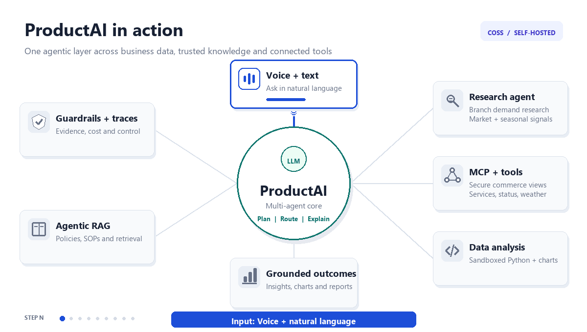
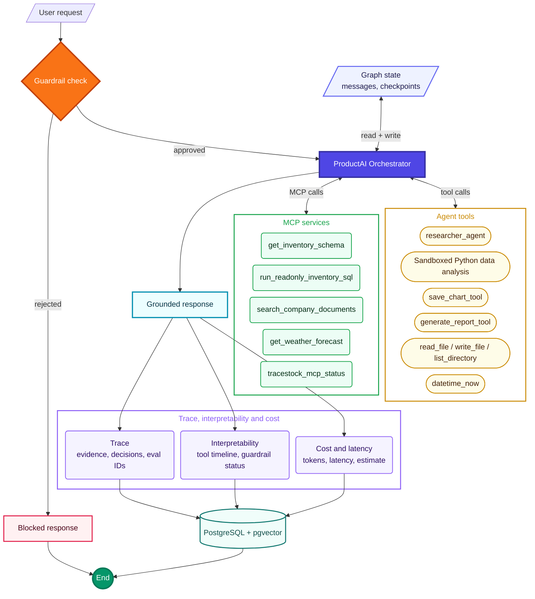
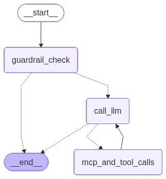
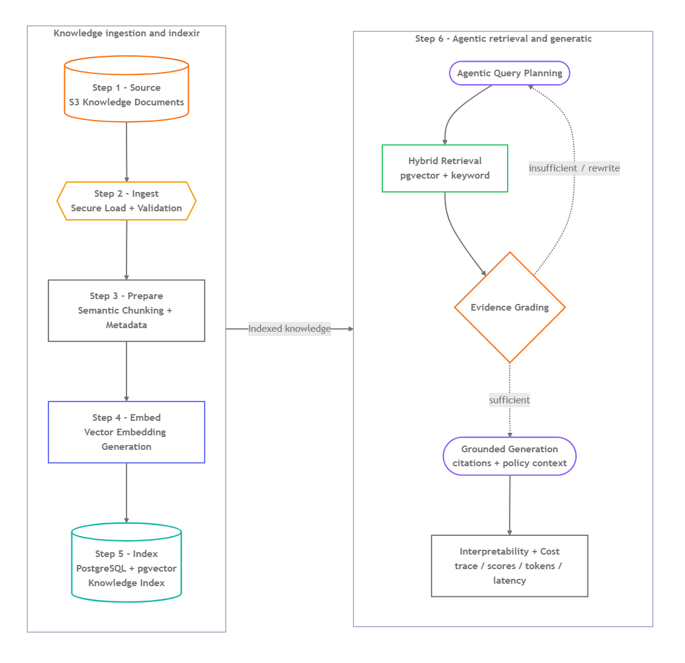

# ProductAI Core

**A self-hosted COSS multi-agent platform that turns commerce data and trusted company knowledge into traceable analysis, artifacts, and support answers.**

**Live deployment:** [Open the ProductAI demo](https://product-ai.up.railway.app/) on Railway.

ProductAI Core is a reusable backend-first product, not only a demo chatbot. Small teams can run it locally, connect it to their own databases, documents, code workspace, and internal tools, and use controlled agentic workflows without hiding execution behind a single opaque model response.

<p align="center">
  
</p>

The animation summarizes the ProductAI loop: users ask business questions by voice or natural language, the multi-agent core orchestrates trusted data and tools, and the system returns grounded insights, charts, reports, and visible execution traces.

## Problem

Commerce teams repeatedly need data-analysis and customer-support work: querying revenue and inventory, identifying demand or stock risk, explaining product and return policies, and preparing charts or reports. Without automation, each request may require a data analyst or customer-support specialist to gather evidence from databases, documents, files, and external signals before producing an answer.

The challenge is not simply generating text:

- **Fragmented evidence:** sales, inventory, returns, products, branches, and policies live in different systems.
- **Unsafe automation:** unrestricted model-generated SQL, Python, or file operations create security and reliability risks.
- **Low trust:** answers are difficult to review without evidence, tool history, guardrail status, latency, tokens, and cost.

## Goal

ProductAI Core aims to automate the repeatable parts of data analysis and customer support without removing organizational control or human review. It provides a reusable agent foundation that teams can self-host and adapt to their domain.

The system is designed to:

- Connect private structured data, trusted documents, code workspaces, and internal tools;
- Turn voice or natural-language requests into grounded analysis, support answers, charts, reports, and operational recommendations;
- Keep planning, execution boundaries, artifacts, traces, and evaluation results visible.

## Solution

ProductAI combines multi-agent orchestration, MCP-backed tools, guarded read-only SQL, PostgreSQL/pgvector RAG, sandboxed Python analytics, report generation, scoped file tools, persisted conversations, and a Next.js merchant interface.

- **DevAnalyst Agent:** automates recurring junior data-analysis and software tasks across revenue, sales, demand, inventory risk, returns, branch performance, market signals, weather context, charts, reports, and scoped UI work.
- **Customer Support Agent:** automates product and policy research for return, refund, fulfillment, and support questions using trusted product data and company documents.

The model plans and orchestrates; approved tools inspect evidence and perform deterministic work. Outputs remain grounded in schemas, rows, document chunks, Python results, and saved artifacts. Guardrails, read-only access, sandboxing, tool traces, latency, tokens, cost, and repeatable evaluations make the workflow reviewable. Because the core is COSS, self-hosted, and extensible, organizations can add their own MCP tools, adapters, knowledge sources, and UI modules.

## What The Agent Can Do

Example prompts:

```text
Which products are at risk of stockout?
Show sales trend by month and generate a chart.
What is our customer return window?
Compare returns by category and create a short report.
Which warehouses have the highest inventory pressure?
Estimate next-week product demand by branch using sales, inventory, season, and weather context.
Search company SOPs and explain the policy behind a product return.
Generate a business report from data evidence and attach it to the chat.
```

For large analytics requests, the system should aggregate in the data layer before plotting. For example, "plot all sales for the last five years" should not send millions of raw rows to the LLM. PostgreSQL groups the data by day/week/month, Python plots the compact result, and the LLM explains the chart.

## Agent Architecture

ProductAI Core is designed as a controlled agentic workflow rather than a single prompt-response call.

**Full agent architecture**



The guardrail check gates every request. Approved requests reach the orchestrator, which reads and writes the typed graph state holding the message history and per-conversation checkpoints, and exchanges calls and observations with the MCP service group and the agent tool group, each listing its actual tools. Every grounded response also emits a trace of the evidence and decisions behind it, an interpretability record of the tool timeline and guardrail status, and a cost record of tokens, latency, and estimated spend. All three persist to PostgreSQL, so any answer can be reviewed after the fact. Rejected requests and completed responses converge on the same end state.

Generated graph assets are also available here:

- Mermaid source: [frontend/public/generated/productai_agent_full_graph.mmd](frontend/public/generated/productai_agent_full_graph.mmd)
- Local browser view after running the frontend: `http://localhost:3000/generated/productai_agent_full_graph.html`

**Compact runtime view**



Runtime responsibilities:

- Validate every request before capability use;
- Orchestrate SQL, MCP, RAG, research, Python, chart, report, and scoped file tools;
- Keep structured analysis grounded in read-only data and policy answers grounded in retrieved document evidence;
- Return reviewable answers and artifacts with tool, latency, token, cost, guardrail, and trace metadata.

<details>
<summary>Tool catalog</summary>

LLM tool calls and usage:

- `datetime_now`: gets the current date/time when the answer depends on today's date.
- `tracestock_mcp_status`: checks MCP connectivity and lists available MCP tools.
- `get_inventory_schema`: inspects data tables, columns, keys, indexes, and optional row counts through MCP.
- `run_readonly_inventory_sql`: executes approved read-only `SELECT`/`WITH` queries through MCP for inventory, sales, returns, products, and warehouses.
- `search_company_documents`: searches indexed company policies, SOPs, return rules, supplier terms, and warehouse playbooks through MCP-backed RAG.
- `researcher_agent`: delegates focused research (demand, seasonality, weather, competitor pricing, branch stock risk) to a bounded sub-agent that runs its own read-only SQL + weather tool loop (up to 14 steps) and returns a concise evidence brief.
- `execute_python_code_tool`: performs derived calculations, transformations, trend analysis, and chart generation after the required data has been retrieved.
- `save_chart_tool`: saves a base64 PNG chart when the agent needs to attach a chart artifact.
- `generate_report_tool`: creates a saved report only when the user explicitly asks for a report, export, downloadable summary, or saved document.
- `read_file`, `write_file`, `list_directory`: scoped frontend workspace tools for reading, updating, and listing files inside the allowed frontend folder.

</details>

Tool and safety design:

- **MCP boundary:** selected capabilities are exposed through the MCP server, then wrapped as LangChain tools for the LangGraph agent.
- **Guardrails first:** requests are validated before execution so unrelated, destructive, or sensitive actions can be rejected early.
- **Read-only data access:** SQL tools are designed for inspection and analysis, not arbitrary data mutation.
- **Sandboxed analytics:** Python is used for calculations and charts inside a restricted execution path.
- **Traceable tool use:** tool names, inputs, outputs, timing, tokens, cost, and trace IDs remain visible instead of being hidden inside the final answer.

## Agentic RAG Architecture

The agentic RAG layer is used for unstructured company knowledge, not live transactional facts. The agent decides when retrieval is needed, calls the company-document search tool, evaluates retrieved evidence, and uses document context only when it supports the answer.

<p align="center">
  <a href="frontend/public/generated/productai_rag_pipeline.png">
    
  </a>
</p>

<p align="center"><sub>Steps 1-5 run vertically on the left; the Step 6 agentic workflow runs vertically on the right. Click to open the full-resolution graph.</sub></p>

<details>
<summary>View Mermaid source</summary>



</details>

```mermaid
flowchart TB
    s3[("Step 1 - Source<br/>S3 Knowledge Documents")]:::source
    load{{"Step 2 - Ingest<br/>Secure Load + Validation"}}:::guard
    chunk["Step 3 - Prepare<br/>Semantic Chunking + Metadata"]:::process
    embed["Step 4 - Embed<br/>Vector Embedding Generation"]:::model
    vector_db[("Step 5 - Index<br/>PostgreSQL + pgvector<br/>Knowledge Index")]:::database

    planner(["Agentic Query Planning"]):::agent
    retrieve["Hybrid Retrieval<br/>pgvector + keyword"]:::retrieval
    grade{"Evidence Grading"}:::condition
    synthesis(["Grounded Generation<br/>citations + policy context"]):::agent
    telemetry["Interpretability + Cost<br/>trace / scores / tokens / latency"]:::trace

    subgraph rag_pipeline[" "]
        direction LR
        subgraph foundation["Knowledge ingestion and indexing"]
            direction TB
            s3 --> load --> chunk --> embed --> vector_db
        end

        subgraph improvements["Step 6 - Agentic retrieval and generation"]
            direction TB
            planner --> retrieve --> grade
            grade -. sufficient .-> synthesis --> telemetry
            grade -. insufficient / rewrite .-> planner
        end
        vector_db ==>|Indexed knowledge| retrieve
    end

    classDef source fill:transparent,stroke:#f97316,color:#737373,stroke-width:2.2px,font-weight:600
    classDef guard fill:transparent,stroke:#f59e0b,color:#737373,stroke-width:2.2px,font-weight:600
    classDef process fill:transparent,stroke:#737373,color:#737373,stroke-width:2px,font-weight:600
    classDef model fill:transparent,stroke:#6366f1,color:#737373,stroke-width:2px,font-weight:600
    classDef database fill:transparent,stroke:#14b8a6,color:#737373,stroke-width:2.4px,font-weight:600
    classDef agent fill:transparent,stroke:#8b5cf6,color:#737373,stroke-width:2.2px,font-weight:600
    classDef retrieval fill:transparent,stroke:#22c55e,color:#737373,stroke-width:2px,font-weight:600
    classDef condition fill:transparent,stroke:#f97316,color:#737373,stroke-width:2.2px,font-weight:600
    classDef trace fill:transparent,stroke:#737373,color:#737373,stroke-width:2px,font-weight:600

    style foundation fill:transparent,stroke:#94a3b8,stroke-width:1.5px,color:#737373,font-weight:600
    style improvements fill:transparent,stroke:#94a3b8,stroke-width:1.5px,color:#737373,font-weight:600
    style rag_pipeline fill:transparent,stroke:transparent
    linkStyle default stroke:#737373,stroke-width:2px,color:#737373
```

Generated RAG graph assets:

- Mermaid source: [frontend/public/generated/productai_rag_pipeline.mmd](frontend/public/generated/productai_rag_pipeline.mmd)
- Rendered PNG: [frontend/public/generated/productai_rag_pipeline.png](frontend/public/generated/productai_rag_pipeline.png)
- Local browser view: `http://localhost:3000/generated/productai_rag_pipeline.html`

Agentic RAG responsibilities:

- Ingest versioned Amazon S3 documents, enrich semantic chunks, generate embeddings, and index them in PostgreSQL/pgvector with keyword fallback;
- Retrieve policies, SOPs, supplier rules, return guidance, and warehouse playbooks with source title, path, version, department, score, and chunk evidence;
- Keep document retrieval separate from live SQL analysis, then combine both evidence types when a question requires them.

## Agent Evaluation

Agentic systems need more than a convincing demo: they need repeatable evidence that the model selected appropriate tools, avoided unsafe capabilities, returned required facts, and completed the task within a reasonable execution budget. ProductAI therefore includes an application-specific benchmark and persisted evaluation workflow.

The current suite contains **40 validated single-turn cases across 13 capability categories**. It covers RAG policy retrieval, SQL analytics, schema discovery, combined SQL + RAG reasoning, research and weather orchestration, Python analytics, chart and report generation, grounded limitations, MCP connectivity, utility tools, no-tool responses, and guardrail behavior.

```text
cases.jsonl -> validate -> select -> budget preflight -> execute /chat
            -> capture trace -> deterministic score -> persist run
            -> batch manifest + Markdown report + evaluation dashboard
```

Each case defines a transparent behavioral contract:

| Evaluation dimension | What is checked |
|---|---|
| Expected tools | Required tools were selected for the task. |
| Forbidden tools | Unnecessary or unsafe tools were not called. |
| Required evidence | Expected normalized facts or flexible term groups appear in the answer. |
| Tool efficiency | Total tool calls stay within the case-specific limit. |

A case passes only when all four checks pass. Batch reports additionally aggregate pass rate, average score, execution errors, tools used, agent latency, token usage, and known trace cost. The budget check is a pre-run estimate that prevents accidental oversized batches; it is not a provider billing cap.

### Verified result snapshot

The latest saved local run evaluates the six guardrail cases with `gpt-5.4-nano`, quick analysis, and concise answers:

| Scope | Cases | Passed | Average score | Errors | Average latency | Known trace cost |
|---|---:|---:|---:|---:|---:|---:|
| Guardrail subset | 6 | 6 | 100% | 0 | 833 ms | $0.000633 |

This is a verified guardrail-subset result, not a claimed full-suite score. Full and filtered runs remain reproducible through the CLI and evaluation dashboard.

Evaluation history is persisted in PostgreSQL through `evaluation_runs`, `evaluation_case_results`, and `evaluation_artifacts`. Raw responses, traces, score files, manifests, and reviewed Markdown reports remain independently inspectable, making failures easier to reproduce instead of reducing them to one unexplained score.

The merchant evaluation dashboard at `/merchant/evaluations` is visible to users for run history and quality trends. Starting a new evaluation is restricted to admin mode, while the backend also exposes a composable CLI:

```powershell
cd backend

# Inspect validated cases
uv run python -m evals list

# Preview selection and estimated cost without API calls
uv run python -m evals batch --category rag_policy --limit 3

# Execute a reviewed batch
uv run python -m evals batch `
  --category rag_policy `
  --limit 3 `
  --budget-usd 0.30 `
  --execute
```

Detailed evaluation design, case fields, artifact flow, and debugging guidance are documented in [backend/evals/README.md](backend/evals/README.md).

## Project Structure

The project follows a layered architecture so the UI, API transport, agent reasoning, tool execution, RAG, data access, and reporting concerns stay separate.

**Frontend Layer**
- `frontend/components/Chat.tsx`: threaded chat experience backed by data-persisted conversation APIs.
- `frontend/components/ChatMessage.tsx`: response rendering, report cards, chart cards, and expandable agent trace UI.
- `frontend/app/merchant/evaluations/page.tsx`: evaluation history, category quality, run details, and admin-controlled benchmark execution.

**API Layer**
- `backend/app/main.py`: FastAPI application entrypoint with chat, trace metadata, report/chart links, and conversation rehydration.
- `backend/app/api/conversations.py`: data-backed conversation and message APIs.
- `backend/app/api/documents.py`: document indexing, listing, deletion, and search APIs.
- `backend/app/api/evaluations.py`: public evaluation results and admin-protected run orchestration APIs.

**Agent Orchestration Layer**
- `backend/app/agents/agent.py`: LangGraph workflow that routes between reasoning, tools, reports, and final responses.
- `backend/app/agents/guardrails.py`: domain validation for business, inventory, sales, returns, and policy questions.
- `backend/app/agents/report_agent.py`: report drafting and Markdown/HTML/PDF rendering flow.

**MCP And Tool Layer**
- `backend/app/mcp/server.py`: MCP server exposing schema inspection, guarded read-only SQL, and company document search.
- `backend/app/tools/mcp_tools.py`: LangChain tool wrappers that let the agent orchestrate MCP tools.
- `backend/app/tools/db.py`: read-only data schema inspection, SQL toolkit setup, and guarded SQL execution.
- `backend/app/tools/rag.py`: company document search tool for policies, SOPs, and internal documentation.
- `backend/app/tools/python_sandbox.py`: restricted Python analytics execution with chart metadata output.
- `backend/app/tools/reporting.py`: report generation tool wrapper used by the main agent.
- `backend/app/tools/voice.py`: optional Whisper transcription service for voice input.

**Data And RAG Layer**
- `backend/app/db`: SQLAlchemy models, sessions, and persistence layer.
- `backend/app/rag`: document chunking, embeddings, ingestion, vector retrieval, and keyword fallback.
- `backend/app/knowledge`: source company documents used by the agentic RAG pipeline.

**Evaluation Layer**
- `backend/evals`: validated benchmark cases, execution, deterministic scoring, batch reporting, and CLI orchestration.
- `backend/app/services/evaluations.py`: persisted run summaries, category metrics, case details, latency, token, and cost aggregation.
- `evaluation_runs`, `evaluation_case_results`, `evaluation_artifacts`: durable evaluation history and artifact metadata.

**Infrastructure Layer**
- `docker-compose.yml`: local PostgreSQL/pgvector service.
- `backend/alembic`: database migrations.
- `HOW_TO_RUN.md`: local setup and runbook.

## Quick Start

For full setup instructions, see [HOW_TO_RUN.md](HOW_TO_RUN.md).

Start PostgreSQL:

```powershell
docker compose up -d db
docker compose ps
```

Run the backend:

```powershell
cd backend
uv sync
uv run alembic upgrade head
uv run python -m app.scripts.seed
uv run uvicorn app.main:app --reload --host 127.0.0.1 --port 8000
```

Run the frontend:

```powershell
cd frontend
npm install
npm run dev
```

Open:

```text
http://localhost:3000
```

## Verification

Backend:

```powershell
cd backend
uv run python -m compileall app evals
uv run python -m app.mcp.smoke
uv run python -m evals list
uv run pytest tests/test_eval_cases.py
```

Frontend:

```powershell
cd frontend
npm run lint
npx tsc --noEmit
```

Optional voice input requires the voice extra, `ffmpeg`, and Whisper configuration. See [HOW_TO_RUN.md](HOW_TO_RUN.md) for details.

## Roadmap

High-impact next steps:

- Extend the Customer Support Agent with authenticated order status, return initiation, escalation, and real-time fulfillment workflows.
- Extend the DevAnalyst Agent with forecasting, anomaly detection, branch-level planning, and stronger executive reporting.
- Expand the benchmark with multi-turn conversations, citation-quality checks, retrieval relevance and faithfulness measures, and isolated fixtures for side-effectful tools.
- Add regression baselines and CI quality gates for critical guardrail, SQL, RAG, and tool-routing cases.
- Add streaming agent timeline events and persistent LangGraph checkpointing.
- Add dedicated MCP analytics tools for large time-series analysis, forecasting, stockout risk, and reorder recommendations.
- Expand operational dashboards for latency, cost, tool failures, guardrail rejections, RAG quality, and evaluation trends.

Detailed plans live in [PROJECT_TODO.md](PROJECT_TODO.md), [RAG_TODO.md](RAG_TODO.md), and [DEPLOYMENT_LLMOPS_PLAN.md](DEPLOYMENT_LLMOPS_PLAN.md).
## License

ProductAI Core is licensed under the [MIT License](LICENSE).

## Contact

For questions, collaboration, or project discussion, contact: `badhon1512@gmail.com`.
