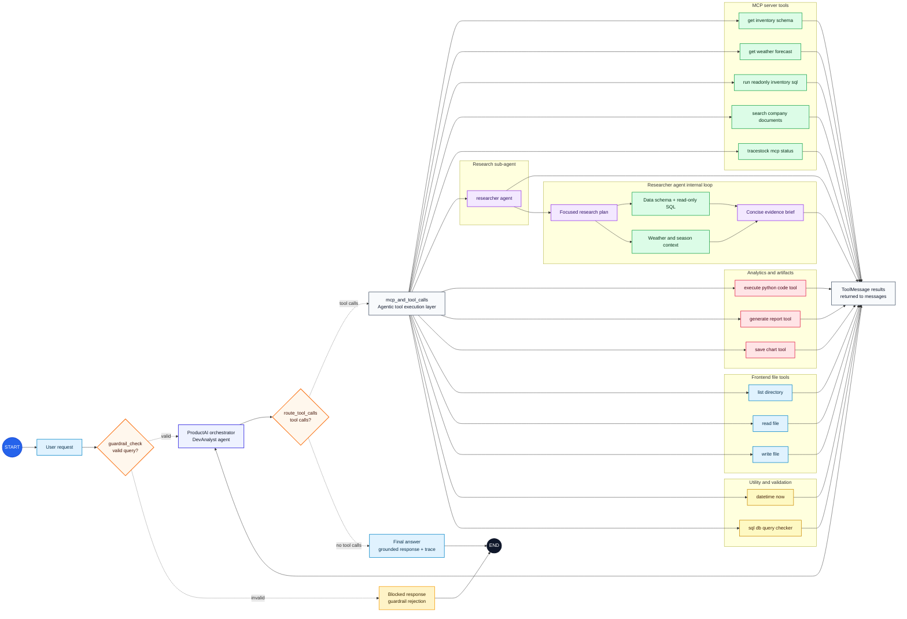

# ProductAI Core

**ProductAI Core** is a COSS, self-hosted agentic commerce platform for small teams that want to connect AI agents to their own business data, documents, code workspace, and internal tools.

It is built as a reusable backend-first product, not only a demo chatbot. Teams can run it locally, point it at their data, index trusted company knowledge, and use agentic workflows for analytics, demand research, reporting, customer support knowledge, and operational decision support.

The current ProductAI commerce demo highlights practical roles that ProductAI can perform:

- **DevAnalyst Agent:** performs junior software engineering and data analysis tasks, including merchant questions about revenue, sales, demand, inventory risk, returns, branch performance, charts, and business reports.
- **Customer Support Agent:** uses product context and trusted policy documents to answer product, return, refund, fulfillment, and support questions.

The system keeps execution transparent with guardrails, tool traces, token usage, estimated cost, response metadata, and generated artifacts that can be reviewed after each answer.

ProductAI Core combines agent orchestration, MCP-backed tools, guarded read-only SQL, PostgreSQL/pgvector RAG, sandboxed Python analytics, report generation, scoped file tools, and a Next.js ProductAI merchant UI with visible traces.

## Product Overview

- **COSS and self-hosted:** designed so small organizations can run the core locally and integrate it with their own data, documents, and internal systems.
- **DevAnalyst Agent:** performs software and data analysis tasks, reasons over product, inventory, branch, sales, revenue, returns, market-signal, weather, and policy data, and can inspect scoped frontend files for safe UI work.
- **Customer Support Agent:** answers product, return, refund, fulfillment, and policy questions using trusted product and company knowledge.
- **Tool-first workflow:** the model plans, while MCP/tools execute schema inspection, read-only SQL, RAG retrieval, analytics, charting, reports, and scoped file actions.
- **Grounded outputs:** answers are based on inspected schemas, retrieved rows, trusted documents, sandboxed Python results, and saved artifacts.
- **Interpretable execution:** each response can expose selected tools, arguments, evidence, latency, token usage, estimated cost, and trace IDs.
- **Extensible backend:** organizations can add custom MCP tools, data adapters, knowledge sources, and UI modules without rewriting the agent core.

## What The Agent Can Do

Example prompts:

```text
Which products are at risk of stockout?
Show sales trend by month and generate a chart.
What is our customer return window?
Compare returns by category and create a short report.
Which warehouses have the highest inventory pressure?
Estimate next-week product demand by branch using sales, inventory, season, and weather context.
Search company SOPs and explain the policy behind a product return.
Generate a business report from data evidence and attach it to the chat.
```

For large analytics requests, the system should aggregate in the data layer before plotting. For example, "plot all sales for the last five years" should not send millions of raw rows to the LLM. PostgreSQL groups the data by day/week/month, Python plots the compact result, and the LLM explains the chart.

## Agent Architecture

ProductAI Core is designed as a controlled agentic workflow rather than a single prompt-response call.

**Expanded agentic capability map**



The expanded figure shows the full agentic surface: MCP tools, SQL checker, read-only SQL execution, document search, weather context, research sub-agent, Python sandbox, chart/report tools, and scoped frontend file tools. Solid edges represent direct workflow edges; dotted edges represent conditional routes.

Generated graph assets are also available here:

- Mermaid source: [frontend/public/generated/productai_agent_full_graph.mmd](frontend/public/generated/productai_agent_full_graph.mmd)
- Local browser view after running the frontend: `http://localhost:3000/generated/productai_agent_full_graph.html`

**Compact runtime view**


The compact graph shows the main runtime loop: user request, guardrail validation, model reasoning, approved tool execution, and final grounded response.

Main agent responsibilities:

- Route every request through a guardrail before tool use.
- Choose between SQL tools, MCP tools, RAG tools, Python analytics, file tools, chart tools, and report tools.
- Keep structured business analysis grounded in schema inspection and read-only SQL.
- Keep company policy answers grounded in retrieved document chunks.
- Use Python for computation and visualization after data has been prepared.
- Return final answers with visible trace metadata, including tool usage, latency, token usage, and estimated cost.
- Serve as a **DevAnalyst Agent** for junior software engineering, data analysis, charts, reports, and demand/stock insights.
- Serve as a **Customer Support Agent** for product, return, refund, fulfillment, and policy answers.

LLM tool calls and usage:

- `datetime_now`: gets the current date/time when the answer depends on today's date.
- `tracestock_mcp_status`: checks MCP connectivity and lists available MCP tools.
- `get_inventory_schema`: inspects data tables, columns, keys, indexes, and optional row counts through MCP.
- `sql_db_query_checker`: validates SQL before execution.
- `run_readonly_inventory_sql`: executes approved read-only `SELECT`/`WITH` queries through MCP for inventory, sales, returns, products, and warehouses.
- `search_company_documents`: searches indexed company policies, SOPs, supplier terms, and warehouse playbooks through MCP-backed RAG.
- `execute_python_code_tool`: performs derived calculations, transformations, trend analysis, and chart generation after the required data has been retrieved.
- `save_chart_tool`: saves a base64 PNG chart when the agent needs to attach a chart artifact.
- `generate_report_tool`: creates a saved report only when the user explicitly asks for a report, export, downloadable summary, or saved document.
- `read_file`, `write_file`, `list_directory`: scoped frontend workspace tools for reading, updating, and listing files inside the allowed frontend folder.

Tool and safety design:

- **MCP boundary:** selected capabilities are exposed through the MCP server, then wrapped as LangChain tools for the LangGraph agent.
- **Guardrails first:** requests are validated before execution so unrelated, destructive, or sensitive actions can be rejected early.
- **Read-only data access:** SQL tools are designed for inspection and analysis, not arbitrary data mutation.
- **Sandboxed analytics:** Python is used for calculations and charts inside a restricted execution path.
- **Traceable tool use:** tool names, inputs, outputs, timing, tokens, cost, and trace IDs remain visible instead of being hidden inside the final answer.

## Agentic RAG Architecture

The agentic RAG layer is used for unstructured company knowledge, not live transactional facts. The agent decides when retrieval is needed, calls the company-document search tool, evaluates retrieved evidence, and uses document context only when it supports the answer.

```text
Company documents
  -> safe ingestion from configured knowledge folder
  -> chunking
  -> embeddings
  -> PostgreSQL + pgvector document_chunks
  -> retrieval through search_company_documents
  -> cited policy-aware answer
```

Agentic RAG responsibilities:

- Search company policies, SOPs, supplier rules, return policies, warehouse playbooks, and internal FAQs.
- Keep document retrieval separate from SQL analysis.
- Store documents and chunks in PostgreSQL-backed tables.
- Use pgvector for semantic retrieval when embeddings are available.
- Fall back to keyword search for local demos if embeddings are unavailable.
- Return source titles, paths, versions, departments, scores, and chunk content for grounded answers.
- Support mixed SQL + RAG answers when a question needs both live business data and policy context.

## Key Capabilities

- **MCP tool layer:** selected backend capabilities are exposed through a local MCP server and called by LangChain tool wrappers.
- **Read-only SQL intelligence:** schema inspection, query checking, and guarded SQL execution for structured business data.
- **Agentic RAG knowledge layer:** the agent retrieves company documents when needed and grounds policy/SOP answers in pgvector-backed evidence.
- **Python analytics sandbox:** calculations, transformations, and chart generation happen outside the LLM.
- **Report and chart artifacts:** generated outputs are saved and surfaced in the chat UI.
- **Traceability and observability:** every important agent step can be inspected through trace metadata, including tool usage, token usage, latency, and estimated cost.
- **Conversation persistence:** chat threads and messages are stored in PostgreSQL and can be rehydrated after restart.
- **Large-data strategy:** raw data stays in the data layer; compact aggregates are sent to Python/LLM for charting and explanation.
- **Optional voice input:** browser recording can be transcribed through the FastAPI backend when voice support is enabled.

## Project Structure

The project follows a layered architecture so the UI, API transport, agent reasoning, tool execution, RAG, data access, and reporting concerns stay separate.

**Frontend Layer**
- `frontend/components/Chat.tsx`: threaded chat experience backed by data-persisted conversation APIs.
- `frontend/components/ChatMessage.tsx`: response rendering, report cards, chart cards, and expandable agent trace UI.

**API Layer**
- `backend/app/main.py`: FastAPI application entrypoint with chat, trace metadata, report/chart links, and conversation rehydration.
- `backend/app/api/conversations.py`: data-backed conversation and message APIs.
- `backend/app/api/documents.py`: document indexing, listing, deletion, and search APIs.

**Agent Orchestration Layer**
- `backend/app/agents/agent.py`: LangGraph workflow that routes between reasoning, tools, reports, and final responses.
- `backend/app/agents/guardrails.py`: domain validation for business, inventory, sales, returns, and policy questions.
- `backend/app/agents/report_agent.py`: report drafting and Markdown/HTML/PDF rendering flow.

**MCP And Tool Layer**
- `backend/app/mcp/server.py`: MCP server exposing schema inspection, guarded read-only SQL, and company document search.
- `backend/app/tools/mcp_tools.py`: LangChain tool wrappers that let the agent orchestrate MCP tools.
- `backend/app/tools/db.py`: read-only data schema inspection, SQL toolkit setup, and guarded SQL execution.
- `backend/app/tools/rag.py`: company document search tool for policies, SOPs, and internal documentation.
- `backend/app/tools/python_sandbox.py`: restricted Python analytics execution with chart metadata output.
- `backend/app/tools/reporting.py`: report generation tool wrapper used by the main agent.
- `backend/app/tools/voice.py`: optional Whisper transcription service for voice input.

**Data And RAG Layer**
- `backend/app/db`: SQLAlchemy models, sessions, and persistence layer.
- `backend/app/rag`: document chunking, embeddings, ingestion, vector retrieval, and keyword fallback.
- `backend/app/knowledge`: source company documents used by the agentic RAG pipeline.

**Infrastructure Layer**
- `docker-compose.yml`: local PostgreSQL/pgvector service.
- `backend/alembic`: database migrations.
- `HOW_TO_RUN.md`: local setup and runbook.

## Roadmap

High-impact next steps:

- Extend the Customer Support Agent for FAQ handling, order-status questions, return-policy guidance, and real-time return/order support workflows.
- Extend the DevAnalyst Agent with forecasting, anomaly detection, branch-level planning, and stronger executive reporting.
- Add eval datasets for expected tool usage, answer grounding, and guardrail behavior.
- Add streaming agent timeline events to the frontend.
- Add persistent LangGraph checkpointing.
- Add citation cards and evals for agentic RAG answers.
- Add dedicated MCP analytics tools for large time-series, forecasting, stockout risk, and reorder recommendations.
- Add CI checks for backend compile/tests, frontend lint/typecheck, migration health, and eval smoke tests.
- Add deployment and observability dashboards for latency, cost, tool failures, guardrail rejects, RAG quality, and eval pass rate.

Detailed plans live in [PROJECT_TODO.md](PROJECT_TODO.md), [RAG_TODO.md](RAG_TODO.md), and [DEPLOYMENT_LLMOPS_PLAN.md](DEPLOYMENT_LLMOPS_PLAN.md).

## Quick Start

For full setup instructions, see [HOW_TO_RUN.md](HOW_TO_RUN.md).

Start PostgreSQL:

```powershell
docker compose up -d db
docker compose ps
```

Run the backend:

```powershell
cd backend
uv sync
uv run alembic upgrade head
uv run python -m app.scripts.seed
uv run uvicorn app.main:app --reload --host 127.0.0.1 --port 8000
```

Run the frontend:

```powershell
cd frontend
npm install
npm run dev
```

Open:

```text
http://localhost:3000
```

## Verification

Backend:

```powershell
cd backend
uv run python -m compileall app
uv run python -m app.mcp.smoke
```

Frontend:

```powershell
cd frontend
npm run lint
npx tsc --noEmit
```

Optional voice input requires the voice extra, `ffmpeg`, and Whisper configuration. See [HOW_TO_RUN.md](HOW_TO_RUN.md) for details.

## Contact

For questions, collaboration, or project discussion, contact: `badhon1512@gmail.com`.
