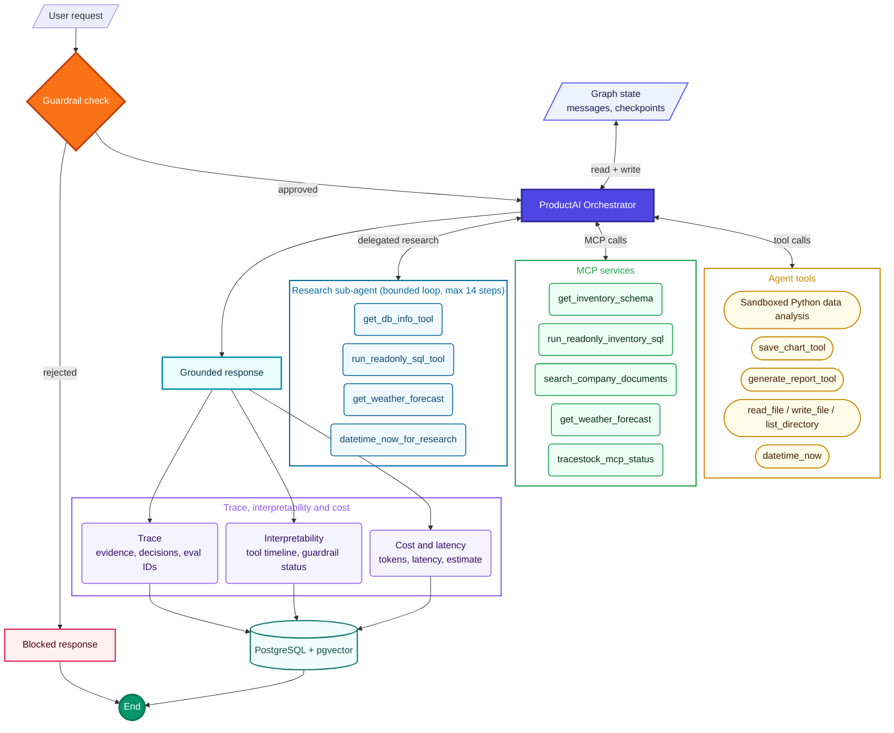
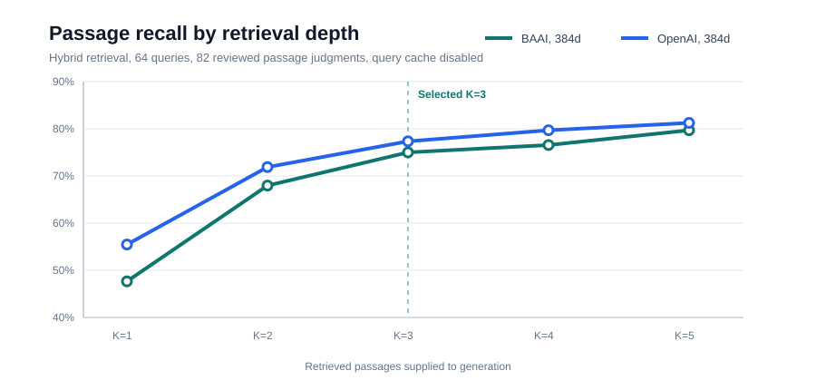

# ProductAI Core

**A self-hosted COSS multi-agent platform for commerce analysis and grounded customer support.**

[Live demo](https://product-ai.up.railway.app/) | [Evaluation dashboard](https://product-ai.up.railway.app/merchant/evaluations) | [MIT License](LICENSE)

ProductAI connects commerce databases, trusted documents, code workspaces, and internal tools to controlled agentic workflows. Teams can run it locally, adapt it to their domain, and inspect the evidence, tools, guardrails, latency, tokens, cost, and evaluations behind each result.

<p align="center">
  
</p>

## Problem

One business question costs an analyst a full working session: query several systems, write throwaway Python to aggregate the result, plot a chart, write it up. The questions keep changing, daily stock risk, weekly revenue, seasonal demand, quarterly returns, so each one starts from scratch against evidence spread across sales, inventory, branches, and policy documents. Handing that to an unrestricted model is worse: generated SQL, Python, and file operations create security and reliability risks, and an answer cannot be reviewed without its evidence, tool history, guardrail status, latency, tokens, and cost.

## Goal

Automate the repeatable parts of both without removing organizational control or human review, as a foundation teams can self-host and adapt. It connects private structured data, trusted documents, code workspaces, and internal tools, turns voice or natural-language requests into grounded analysis, charts, and reports, and keeps planning, execution boundaries, artifacts, traces, and evaluation results visible.

## Solution

Multi-agent orchestration over MCP-backed tools: guarded read-only SQL, PostgreSQL/pgvector RAG, sandboxed Python, report generation, scoped file tools, and a Next.js merchant interface.

- **DevAnalyst Agent:** queries the commerce database over a secure read-only connection, restricted to curated views and `SELECT`/`WITH` statements, then writes and runs its own Python in a sandbox to aggregate the result and returns the chart and written report alongside the SQL and rows behind them, across revenue, demand, inventory risk, returns, branch performance, and weather context.
- **Customer Support Agent:** answers return, refund, fulfillment, and policy questions from the same read-only product data and from company documents, citing the clause it relied on.

The model plans; approved tools do deterministic work grounded in schemas, rows, document chunks, and artifacts. Guardrails, read-only access, sandboxing, traces, and repeatable evaluations keep it reviewable, and the COSS core accepts an organization's own MCP tools, adapters, and knowledge sources.

## Impact

| Production capability | Current implementation |
|---|---|
| Controlled automation | Guardrails, read-only views, sandboxed execution, and scoped tools |
| Grounded intelligence | Commerce data, company documents, research, weather, and deterministic calculations |
| Reviewable operations | Evidence, traces, checkpoints, artifacts, latency, tokens, cost, and evaluation IDs |
| Verified quality | 40 agent cases and 64 production RAG retrieval cases |

**Latest local BAAI RAG baseline:** 82.81% case pass rate, 84.38% Hit@5, 79.69% passage Recall@5, 0.6886 nDCG@5, and 164 ms P95 latency across 64 passage-judged cases with query caching disabled.

## What The Agent Can Do

Example prompts:

```text
Which products are at risk of stockout?
Show sales trend by month and generate a chart.
What is our customer return window?
Compare returns by category and create a short report.
Which warehouses have the highest inventory pressure?
Estimate next-week product demand by branch using sales, inventory, season, and weather context.
Search company SOPs and explain the policy behind a product return.
Generate a business report from data evidence and attach it to the chat.
```

For large analytics requests, the system should aggregate in the data layer before plotting. For example, "plot all sales for the last five years" should not send millions of raw rows to the LLM. PostgreSQL groups the data by day/week/month, Python plots the compact result, and the LLM explains the chart.

## Agent Architecture

ProductAI Core is designed as a controlled agentic workflow rather than a single prompt-response call.

**Full agent architecture**



**Compact runtime view**


Runtime responsibilities:

- Validate every request before capability use;
- Orchestrate SQL, MCP, RAG, research, Python, chart, report, and scoped file tools;
- Keep structured analysis grounded in read-only data and policy answers grounded in retrieved document evidence;
- Return reviewable answers and artifacts with tool, latency, token, cost, guardrail, and trace metadata.

<details>
<summary>Tool catalog</summary>

LLM tool calls and usage:

- `datetime_now`: gets the current date/time when the answer depends on today's date.
- `tracestock_mcp_status`: checks MCP connectivity and lists available MCP tools.
- `get_inventory_schema`: inspects data tables, columns, keys, indexes, and optional row counts through MCP.
- `run_readonly_inventory_sql`: executes approved read-only `SELECT`/`WITH` queries through MCP for inventory, sales, returns, products, and warehouses.
- `search_company_documents`: searches indexed company policies, SOPs, return rules, supplier terms, and warehouse playbooks through MCP-backed RAG.
- `researcher_agent`: delegates focused research (demand, seasonality, weather, competitor pricing, branch stock risk) to a bounded sub-agent that runs its own read-only SQL + weather tool loop (up to 14 steps) and returns a concise evidence brief.
- `execute_python_code_tool`: performs derived calculations, transformations, trend analysis, and chart generation after the required data has been retrieved.
- `save_chart_tool`: saves a base64 PNG chart when the agent needs to attach a chart artifact.
- `generate_report_tool`: creates a saved report only when the user explicitly asks for a report, export, downloadable summary, or saved document.
- `read_file`, `write_file`, `list_directory`: scoped frontend workspace tools for reading, updating, and listing files inside the allowed frontend folder.

</details>

Tool and safety design:

- **MCP boundary:** selected capabilities are exposed through the MCP server, then wrapped as LangChain tools for the LangGraph agent.
- **Guardrails first:** requests are validated before execution so unrelated, destructive, or sensitive actions can be rejected early.
- **Read-only data access:** SQL tools are designed for inspection and analysis, not arbitrary data mutation.
- **Sandboxed analytics:** Python is used for calculations and charts inside a restricted execution path.
- **Traceable tool use:** tool names, inputs, outputs, timing, tokens, cost, and trace IDs remain visible instead of being hidden inside the final answer.

## Agentic RAG Architecture

The agentic RAG layer is used for unstructured company knowledge, not live transactional facts. The agent decides when retrieval is needed, calls the company-document search tool, evaluates retrieved evidence, and uses document context only when it supports the answer.

<p align="center">
  <a href="frontend/public/generated/productai_rag_pipeline.png">
    
  </a>
</p>

<p align="center"><sub>Steps 1-5 run vertically on the left; the Step 6 agentic workflow runs vertically on the right. Click to open the full-resolution graph.</sub></p>

<details>
<summary>View Mermaid source</summary>


</details>

Agentic RAG responsibilities:

- Ingest versioned Amazon S3 documents, enrich semantic chunks, generate selectable local BAAI or OpenAI embeddings, and index both independently in PostgreSQL/pgvector with keyword fallback;
- Retrieve policies, SOPs, supplier rules, return guidance, and warehouse playbooks with source title, path, version, department, score, and chunk evidence;
- Keep document retrieval separate from live SQL analysis, then combine both evidence types when a question requires them.

## Evaluation

ProductAI treats evaluation as a production subsystem, not a demo score. Agent and RAG suites use validated cases, deterministic checks, persisted run history, quality gates, category slices, and inspectable failure artifacts. Results are visible at `/merchant/evaluations`; execution is admin-only.

### Suite Coverage

| Suite | Cases | Coverage |
|---|---:|---|
| Agent behavior | 40 | Tool routing, required evidence, forbidden capabilities, tool efficiency, SQL, research, Python, reports, and guardrails |
| RAG retrieval | 64 | 82 reviewed passage judgments with a 19 direct / 45 conversational, implicit, complex, or typo-heavy query split across 18 categories |

### Production RAG Baseline

The application uses [`BAAI/bge-small-en-v1.5`](https://huggingface.co/BAAI/bge-small-en-v1.5) through [FastEmbed](https://qdrant.github.io/fastembed/examples/Supported_Models/) as its default embedding model. It runs locally with quantized ONNX inference and produces 384-dimensional vectors. `text-embedding-3-small` remains available as a selectable OpenAI baseline, shortened to the same 384 dimensions through OpenAI's supported `dimensions` parameter.

Why BAAI is the production default:

- **Self-hosted retrieval:** document and query embedding does not require an external embedding request, which better matches the COSS deployment model and keeps retrieval available without a provider dependency.
- **Controlled vector size:** both models use separate 384-dimensional HNSW indexes, controlling pgvector storage and distance-computation effects during comparison.
- **No per-request embedding API fee:** inference uses local CPU resources; OpenAI remains optional when its stronger early-ranking result is worth the hosted API dependency and cost.
- **Measured quality, not assumed quality:** models use separate HNSW indexes and the same versioned corpus, passage qrels, K-depth, and scoring logic. Every persisted run records its provider, model, dimensions, latency, and ranking metrics.

### Embedding Comparison

BAAI and OpenAI are independently indexed and were evaluated with the same hybrid retriever, 64 queries, 82 passage judgments, K-depths, and no-query-cache policy.

| Embedding model | Dimensions | Pass | Hit@1 | Hit@5 | Recall@5 | MRR@5 | nDCG@5 | P50 | P95 |
|---|---:|---:|---:|---:|---:|---:|---:|---:|---:|
| **BAAI/bge-small-en-v1.5** | **384** | **82.81%** | 56.25% | **84.38%** | 79.69% | 0.6880 | 0.6886 | **150 ms** | **164 ms** |
| OpenAI text-embedding-3-small | **384** | **84.38%** | **65.62%** | **84.38%** | **81.25%** | **0.7409** | **0.7372** | 264 ms | 295 ms |

With vector dimensions controlled at 384, OpenAI ranks relevant passages more strongly and leads Recall@5 by 1.56 percentage points. BAAI remains the production default because it is self-hosted, avoids per-query API cost, and recorded 43% lower P50 latency. Equal dimensions control index size and vector-distance work; the remaining latency difference includes local versus hosted query embedding generation and network overhead.

<p align="center">
  
</p>

#### Retrieval Depth Selection

| K | BAAI Recall@K | OpenAI Recall@K | BAAI context | OpenAI context |
|---:|---:|---:|---:|---:|
| 1 | 47.66% | 55.47% | ~253 tokens | ~256 tokens |
| 2 | 67.97% | 71.88% | ~513 tokens | ~514 tokens |
| **3** | **75.00%** | **77.34%** | **~776 tokens** | **~768 tokens** |
| 4 | 76.56% | 79.69% | ~1,037 tokens | ~1,020 tokens |
| 5 | 79.69% | 81.25% | ~1,282 tokens | ~1,272 tokens |

Token counts are estimates based on approximately four English-text characters per token; exact usage depends on the generation model's tokenizer.

**Selected production depth: K=3.** It captures the main recall gains while using about 40% less context than K=5. Use K=5 for recall-sensitive policy or multi-source requests; it adds 4.69 points for BAAI and 3.91 points for OpenAI at the cost of roughly 500 additional context tokens per query.

### Retrieval Strategy Comparison

BAAI was evaluated across keyword, vector, and hybrid retrieval using the same 64 cases, 82 reviewed passage qrels, corpus, and K-depth settings:

| Retrieval | Pass | Hit@1 | Hit@5 | Passage Recall@5 | MRR@5 | nDCG@5 | P50 | P95 |
|---|---:|---:|---:|---:|---:|---:|---:|---:|
| Keyword | 62.50% | 45.31% | 70.31% | 66.41% | 0.5557 | 0.5632 | **68 ms** | **79 ms** |
| Vector | 78.12% | 53.12% | **85.94%** | 77.34% | 0.6461 | 0.6424 | 78 ms | 88 ms |
| **Hybrid** | **82.81%** | **56.25%** | 84.38% | **79.69%** | **0.6880** | **0.6886** | 150 ms | 164 ms |

Hybrid remains the default because it gives the strongest end-to-end pass rate, passage recall, MRR, and ranking quality. Vector retrieval is substantially faster than hybrid and has the highest Hit@5. Keyword retrieval has the lowest latency, but passage judgments show that it often misses the exact answer-bearing chunk.

These results are from no-query-cache runs. The BAAI strategy comparison made
192 requests and the OpenAI model baseline made 64 requests. All 256 requests
disabled the embedding cache, sent HTTP no-store headers, ran without a warm-up
request, and wrote new timestamped results instead of reusing saved responses.
The runner validated the cache policy before saving each artifact. Model weights remain loaded and normal
PostgreSQL/operating-system buffers remain active; this measures steady
production retrieval rather than process startup or an artificially flushed
database. The runner fails before writing an artifact if the API reports an
enabled query cache or omits the no-store response policy.

### Query Robustness

The suite enforces a 29.7% direct / 70.3% robust-query mix instead of allowing easy lookup wording to dominate:

| Query style | Cases | Hybrid pass | Hit@5 | Passage Recall@5 | MRR@5 | nDCG@5 |
|---|---:|---:|---:|---:|---:|---:|
| Direct | 19 | 94.74% | 100.00% | 92.11% | 0.8158 | 0.8077 |
| Complex | 20 | 90.00% | 90.00% | 85.00% | 0.7250 | 0.7279 |
| Conversational | 9 | 55.56% | 55.56% | 55.56% | 0.4444 | 0.4735 |
| Implicit | 8 | 62.50% | 75.00% | 68.75% | 0.5250 | 0.5319 |
| Noisy / typo-heavy | 8 | 87.50% | 87.50% | 81.25% | 0.7500 | 0.7335 |

The gap identifies conversational and implicit intent as the next retrieval-improvement target. Reports retain document source recall as a diagnostic, while passage recall, Hit@K, MRR, and nDCG are computed from stable answer-bearing passage judgments. The current production quality gate intentionally fails under the stricter labels; it should only pass after retrieval improves, not by weakening the ground truth.

### Agent Snapshot

| Scope | Model | Cases | Passed | Errors | Average latency | Known trace cost |
|---|---|---:|---:|---:|---:|---:|
| Guardrail regression | `gpt-5.4-nano` | 6 | 6 | 0 | 833 ms | $0.000633 |

This is a verified guardrail subset, not a claimed full-agent-suite result.

### Run The Suites

```powershell
cd backend

# Inspect and preview without executing
uv run python -m evals list
uv run python -m evals rag list
uv run python -m evals batch --category guardrail --limit 6
uv run python -m evals rag batch --limit 10
uv run python -m evals rag compare --limit 10

# Execute persisted runs
uv run python -m evals batch --category guardrail --limit 6 --budget-usd 0.30 --execute
uv run python -m evals rag batch --execute
uv run python -m evals rag compare --execute

# Compare embedding models with the same hybrid suite
uv run python -m evals rag batch --execute --embedding-model BAAI/bge-small-en-v1.5
uv run python -m evals rag batch --execute --embedding-model text-embedding-3-small
```

Both suites persist runs, case results, metrics, and artifacts through `evaluation_runs`, `evaluation_case_results`, and `evaluation_artifacts`. See [backend/evals/README.md](backend/evals/README.md) for case contracts, scoring logic, reports, and debugging order.

## Project Structure

<details>
<summary>Full layer and directory breakdown</summary>

The project follows a layered architecture so the UI, API transport, agent reasoning, tool execution, RAG, data access, and reporting concerns stay separate.

**Frontend Layer**
- `frontend/components/Chat.tsx`: threaded chat experience backed by data-persisted conversation APIs.
- `frontend/components/ChatMessage.tsx`: response rendering, report cards, chart cards, and expandable agent trace UI.
- `frontend/app/merchant/evaluations/page.tsx`: evaluation history, category quality, run details, and admin-controlled benchmark execution.

**API Layer**
- `backend/app/main.py`: FastAPI application entrypoint with chat, trace metadata, report/chart links, and conversation rehydration.
- `backend/app/api/conversations.py`: data-backed conversation and message APIs.
- `backend/app/api/documents.py`: document indexing, listing, deletion, and search APIs.
- `backend/app/api/evaluations.py`: public evaluation results and admin-protected run orchestration APIs.

**Agent Orchestration Layer**
- `backend/app/agents/agent.py`: LangGraph workflow that routes between reasoning, tools, reports, and final responses.
- `backend/app/agents/guardrails.py`: domain validation for business, inventory, sales, returns, and policy questions.
- `backend/app/agents/report_agent.py`: report drafting and Markdown/HTML/PDF rendering flow.

**MCP And Tool Layer**
- `backend/app/mcp/server.py`: MCP server exposing schema inspection, guarded read-only SQL, and company document search.
- `backend/app/tools/mcp_tools.py`: LangChain tool wrappers that let the agent orchestrate MCP tools.
- `backend/app/tools/db.py`: read-only data schema inspection, SQL toolkit setup, and guarded SQL execution.
- `backend/app/tools/rag.py`: company document search tool for policies, SOPs, and internal documentation.
- `backend/app/tools/python_sandbox.py`: restricted Python analytics execution with chart metadata output.
- `backend/app/tools/reporting.py`: report generation tool wrapper used by the main agent.
- `backend/app/tools/voice.py`: optional Whisper transcription service for voice input.

**Data And RAG Layer**
- `backend/app/db`: SQLAlchemy models, sessions, and persistence layer.
- `backend/app/rag`: document chunking, embeddings, ingestion, vector retrieval, and keyword fallback.
- `backend/app/knowledge`: source company documents used by the agentic RAG pipeline.

**Evaluation Layer**
- `backend/evals`: agent and RAG cases, deterministic scoring, ranking metrics, quality gates, reports, persistence, and CLI orchestration.
- `backend/app/services/evaluations.py`: suite-isolated run summaries, category metrics, case details, latency, token, and cost aggregation.
- `evaluation_runs`, `evaluation_case_results`, `evaluation_artifacts`: durable evaluation history and artifact metadata.

**Infrastructure Layer**
- `docker-compose.yml`: local PostgreSQL/pgvector service.
- `backend/alembic`: database migrations.
- `HOW_TO_RUN.md`: local setup and runbook.

</details>

## Quick Start

For full setup instructions, see [HOW_TO_RUN.md](HOW_TO_RUN.md).

Start PostgreSQL:

```powershell
docker compose up -d db
docker compose ps
```

Run the backend:

```powershell
cd backend
uv sync
uv run alembic upgrade head
uv run python -m app.scripts.seed
uv run uvicorn app.main:app --reload --host 127.0.0.1 --port 8000
```

Run the frontend:

```powershell
cd frontend
npm install
npm run dev
```

Open:

```text
http://localhost:3000
```

## Verification

<details>
<summary>Step-by-step verification checklist</summary>

Backend:

```powershell
cd backend
uv run python -m compileall app evals
uv run python -m app.mcp.smoke
uv run python -m evals list
uv run pytest tests/test_eval_cases.py
```

Frontend:

```powershell
cd frontend
npm run lint
npx tsc --noEmit
```

Optional voice input requires the voice extra, `ffmpeg`, and Whisper configuration. See [HOW_TO_RUN.md](HOW_TO_RUN.md) for details.

</details>

## Roadmap

High-impact next steps:

- Extend the Customer Support Agent with authenticated order status, return initiation, escalation, and real-time fulfillment workflows.
- Extend the DevAnalyst Agent with forecasting, anomaly detection, branch-level planning, and stronger executive reporting.
- Add answer-quality evaluation for multi-turn behavior, faithfulness, citation quality, abstention, and side-effectful tools.
- Add regression baselines and CI quality gates for critical guardrail, SQL, RAG, and tool-routing cases.
- Add streaming agent timeline events and persistent LangGraph checkpointing.
- Add dedicated MCP analytics tools for large time-series analysis, forecasting, stockout risk, and reorder recommendations.
- Add cross-run RAG trends, index/model comparisons, regression alerts, and CI quality-gate enforcement.

Detailed plans live in [PROJECT_TODO.md](PROJECT_TODO.md), [RAG_TODO.md](RAG_TODO.md), and [DEPLOYMENT_LLMOPS_PLAN.md](DEPLOYMENT_LLMOPS_PLAN.md).
## License

ProductAI Core is licensed under the [MIT License](LICENSE).

## Contact

For questions, collaboration, or project discussion, contact: `badhon1512@gmail.com`.
